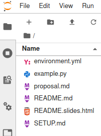
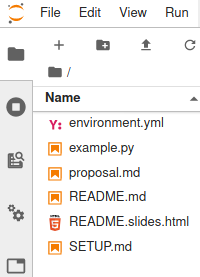

<!--

---
jupyter:
  jupytext:
    hide_notebook_metadata: true
    text_representation:
      extension: .md
      format_name: markdown
      format_version: '1.2'
      jupytext_version: 1.6.0
  kernelspec:
    display_name: Python [conda env:jupytext-demo] *
    language: python
    name: conda-env-jupytext-demo-py
---

-->

<!-- #region slideshow={"slide_type": "slide"} -->

<!-- #endregion -->

<!-- #region slideshow={"slide_type": "slide"} -->
# Who am I

Marc Wouts
- Researcher at [Capital Fund Management](www.cfm.fr)
- Mathematician by training
- Author of Jupytext
<!-- #endregion -->

<!-- #region slideshow={"slide_type": "slide"} -->
# Why Jupytext?
<!-- #endregion -->

<!-- #region slideshow={"slide_type": "subslide"} -->
Jupyter Notebooks are great!

But `.ipynb` files have a few limitations:
- You can only edit them in Jupyter (1)
- They are not so well suited for version control (2), (3)

(1) Well, this is changing, see [Jupyter Notebooks in the IDE: VS Code versus PyCharm](https://towardsdatascience.com/jupyter-notebooks-in-the-ide-visual-studio-code-versus-pycharm-5e72218eb3e8)  
(2) Too large, mix user inputs with programmatic outputs  
(3) JSON is hard to merge
<!-- #endregion -->

<!-- #region slideshow={"slide_type": "subslide"} -->
The idea behind Jupytext

- Keep using Jupyter Notebooks!
- Store them in a format that makes sense outside of Jupyter

Formats supported by Jupytext:
- Scripts (Julia, Python, R,...)
- Markdown files
<!-- #endregion -->

<!-- #region slideshow={"slide_type": "slide"} -->
# Installing Jupytext

`pip install jupytext ` or ` conda install jupytext -c conda-forge`

Restart Jupyter... and text files become notebooks!

| Before | | After |
| --- | --- | --- |
|  | |  |
<!-- #endregion -->

<!-- #region slideshow={"slide_type": "slide"} -->
# Using text notebooks

*Demo*
- `example.py` has a notebook icon! Open it _as a notebook_.
- Set the appropriate kernel and run the notebook
- Modify the file in Jupyter, save, and see the change on the script
- Modify the script in a text editor (1), and _reload_ it in Jupyter:
  - Inputs are updated
  - Outputs are gone (2)
  - Python variables are still there
- Add the kernel to the `.py` file with the _Include Metadata_ command

(1) If your edit takes more than 2 minutes, answer 'Reload' to the message in Jupyter telling you that the notebook has changed on disk, and consider a) turning the Jupyter autosave off or b) closing the notebook while you edit the text file  
(2) To be solved at the next slide
<!-- #endregion -->

<!-- #region slideshow={"slide_type": "slide"} -->
# Paired notebooks

Text notebooks with persistent outputs!

The notebook is saved to an `.ipynb` and a `.py` file. 

Outputs are loaded from the `.ipynb` file, and inputs are  
taken from the `.py` file if present.

Paired notebooks are robust. You can delete any file in the pair.  
Share only one file, the other one will be recreated.
<!-- #endregion -->

<!-- #region slideshow={"slide_type": "slide"} -->
# How to pair notebooks
<!-- #endregion -->

<!-- #region slideshow={"slide_type": "subslide"} -->
## Pairing an individual notebook in Jupyter

| Jupyter Lab | Jupyter Notebook |
| --- | --- |
|  |  |
<!-- #endregion -->

<!-- #region slideshow={"slide_type": "subslide"} -->
## Pairing notebooks globally using a [configuration file](https://jupytext.readthedocs.io/en/latest/config.html)

Create a `jupytext.toml` file with this content:
```
default_jupytext_formats = ipynb,py:percent
```

You can also pair in different subfolders:
```
default_jupytext_formats = notebooks///ipynb,scripts///py:percent
```
<!-- #endregion -->

<!-- #region slideshow={"slide_type": "slide"} -->
# Jupytext at the command line
<!-- #endregion -->

<!-- #region slideshow={"slide_type": "subslide"} -->
## Notebook to text
```bash
jupytext --to markdown notebook.ipynb
jupytext --to script notebook.ipynb
```
<!-- #endregion -->

<!-- #region slideshow={"slide_type": "subslide"} -->
## Text to notebook

```bash
jupytext --to notebook notebook.py
jupytext --to notebook notebook.md
```
<!-- #endregion -->

<!-- #region slideshow={"slide_type": "subslide"} -->
## Text to notebook & preserve outputs

```bash
jupytext --to notebook --update notebook.py
jupytext --to notebook --update notebook.md
```
<!-- #endregion -->

<!-- #region slideshow={"slide_type": "subslide"} -->
## Pair notebooks

```bash
jupytext --set-formats ipynb,py:percent notebook.ipynb
```

## Synchronize paired notebooks

```bash
jupytext --sync notebook.ipynb
```
<!-- #endregion -->

<!-- #region slideshow={"slide_type": "slide"} -->
# What can I do with Jupytext?
<!-- #endregion -->

<!-- #region slideshow={"slide_type": "subslide"} -->
## Version control

Jupytext formats are concise and have clean diffs
<!-- #endregion -->

<!-- #region slideshow={"slide_type": "subslide"} -->
## Merge notebooks

`.py` and `.md` files are easy to merge - unlike `.ipynb` (JSON)
<!-- #endregion -->

<!-- #region slideshow={"slide_type": "subslide"} -->
## Write notebooks

- Copy/paste content from other notebooks
- Edit your notebook in your favorite text editor
- Or in Jupyter!
<!-- #endregion -->

<!-- #region slideshow={"slide_type": "subslide"} -->
## Search in notebooks

Easily find all the references to a function or a dataset  
within your notebooks!
<!-- #endregion -->

<!-- #region slideshow={"slide_type": "subslide"} -->
## Refactor your notebooks into libraries

Access to your notebooks as scripts, and refactor them: 
- move your code into libraries
- document & test it!
<!-- #endregion -->

<!-- #region slideshow={"slide_type": "subslide"} -->
## Code style and checks

You like to apply `flake8`, `black`, `isort` on scripts?  
Jupytext let you do the same on notebooks:

```bash
jupytext --pipe black notebook.ipynb
```
<!-- #endregion -->

<!-- #region slideshow={"slide_type": "slide"} -->
# Why so many [Jupytext formats](https://jupytext.readthedocs.io/en/latest/formats.html)?

Because you can do different things with them!

| Notebook content | You want? | Recommended format | Compatible with |
| --- | --- | --- | --- |
| Mostly code | A simple script | `py:light` | Everything |
| | A notebook-like script | `py:percent` | VS Code, PyCharm Pro, Spyder, Hydrogen, PTVS |
| Text & code | Render the `.md` on GitHub | `md:markdown` | VS Code, PyCharm, GitHub, ... |
| | Write a book (cross references, biblio) | `md:myst` | Jupyter Book |
| | Edit a notebook in Jupyter & RStudio | `Rmd` | RStudio, `knitr`, `bookdown` |
<!-- #endregion -->

<!-- #region slideshow={"slide_type": "slide"} -->
# Awesome projects that use Jupytext

## [Jupyter Book](https://jupyterbook.org)

Write a book made of notebooks

## [Plotly.py](https://github.com/plotly/plotly.py/tree/master/doc)

Plotly.py's documentation is a collection of Jupytext Markdown Notebooks.   
Read or edit them directly on GitHub!

## [AI Habitat](https://github.com/facebookresearch/habitat-sim/blob/master/.pre-commit-config.yaml)

Lint notebooks with `isort` and `black` in a pre-commit hook
<!-- #endregion -->
<!-- #region slideshow={"slide_type": "slide"} -->
# See you on GitHub

[](https://GitHub.com/mwouts/jupytext/stargazers/)
[](https://GitHub.com/mwouts/jupytext/graphs/contributors/)

[](https://codecov.io/gh/mwouts/jupytext/branch/master)
[](https://lgtm.com/projects/g/mwouts/jupytext/context:python)


[](https://opensource.org/licenses/MIT)
[](https://anaconda.org/conda-forge/jupytext)
[](https://pypi.python.org/pypi/jupytext)
[](https://pypi.python.org/pypi/jupytext)

Follow me on Twitter [@marcwouts](https://twitter.com/marcwouts/) or on Medium [@marc.wouts](https://medium.com/@marc.wouts)
<!-- #endregion -->
